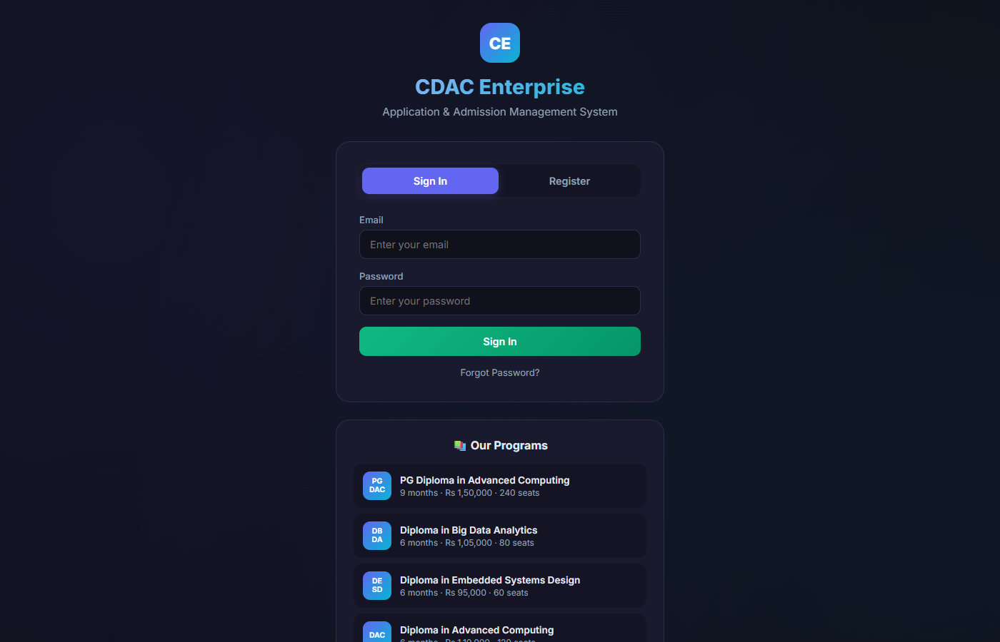
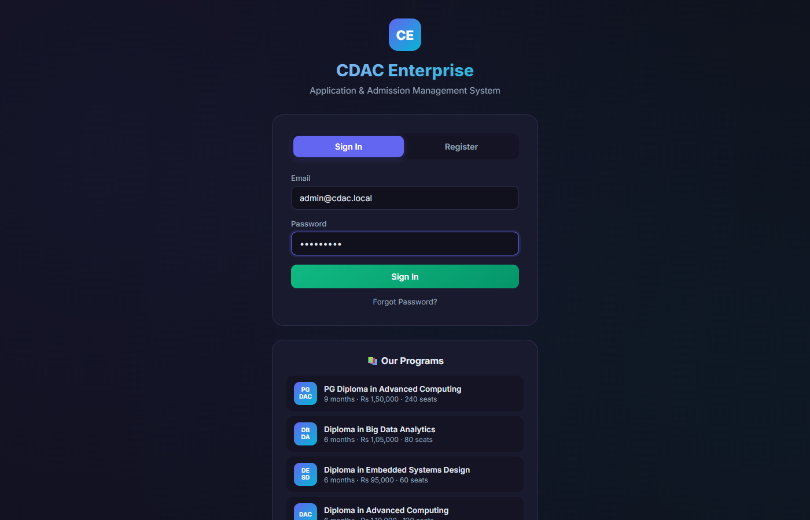
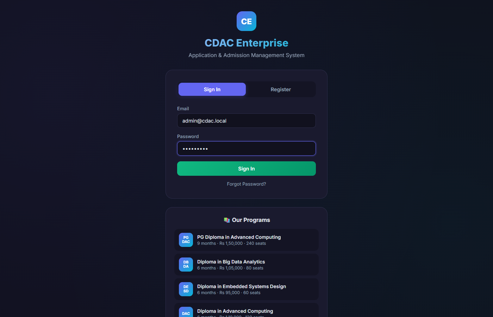
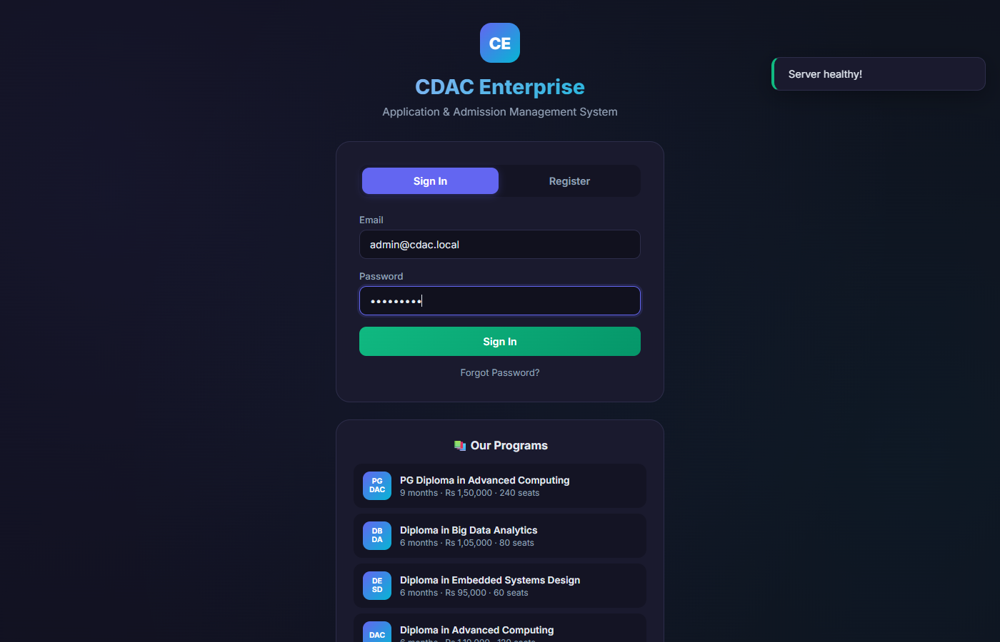

# 🏢 CDAC Enterprise Application & Admission Management System

A **production-grade** Spring Boot 3 REST API backend for managing institutional applications, courses, admissions, user authentication, document uploads, and audit logging — with a **beautiful interactive frontend** for API testing.

[](https://enterprise-latest.onrender.com)

---

## 📸 Screenshots & Demo

> ⚡ The application includes a **fully interactive single-page frontend** — no separate frontend framework needed. All screenshots below are captured from the live application at `http://localhost:8080`.

### 🔐 Login Page

| |
|---|
|  |
| *Clean login form with gradient background, course info section below, and forgot password flow. No credentials pre-filled.* |

### 📊 Admin Dashboard

| |
|---|
|  |
| *7 stat cards: Total Users, Courses, Applications, Documents, Pending Reviews, Notifications, Unread. Gradient cards with hover animations.* |

### 📚 Courses Management

| |
|---|
|  |
| *Search, create, edit, soft-delete courses. Admin "Show All" toggle for inactive courses. Paginated with smooth transitions.* |

### 📋 Applications & Review Workflow

| |
|---|
|  |
| *Students submit applications with SOP. Admin reviews with Approve/Reject flow. Status filter (All, Submitted, Under Review, Approved, Rejected).* |

### 📄 Document Upload

| |
|---|
|  |
| *Upload PDFs, images, documents with type selector. View uploaded documents with sizes and dates in a paginated table.* |

### 🔔 Notifications

| |
|---|
|  |
| *Automatic notifications on application status changes. Mark-as-read, filter unread, paginated list with timestamps.* |

### 👥 User Management (Admin)

| |
|---|
|  |
| *List all users with role badges, edit inline modal, soft-delete, email search. Paginated with responsive table.* |

### 📜 Audit Logs

| |
|---|
|  |
| *Complete audit trail with actor, action, IP tracking. Paginated with color-coded action badges.* |

### 🩺 Health Check

| |
|---|
|  |
| *Simple health endpoint showing system status. Useful for monitoring and deployment checks.* |

> 🎥 *Demo video coming soon — screenshots above showcase the current UI in action.*

---

## ✨ Features

### 🔐 Authentication & Authorization
- **JWT-based authentication** with access tokens (configurable expiry, default 15 min)
- **Role-based access control** (`ROLE_STUDENT`, `ROLE_ADMIN`)
- **Method-level security** via `@PreAuthorize` annotations
- Secure password hashing with **BCrypt**
- Public registration + admin seeding on startup
- **Forgot / Reset password** flow with token-based email verification

### 👥 User Management (Admin)
- List all non-deleted users with pagination
- Get user by ID, search by email
- Update user profile (name, phone)
- Soft-delete users

### 📚 Course Management
- Full CRUD for courses (admin only)
- Soft-delete support (`deleted` flag)
- Active/inactive course state
- Search by name with pagination

### 📋 Application Management
- Students can submit applications for active courses
- **Duplicate application prevention** (one per student per course)
- Admin review workflow: `SUBMITTED → UNDER_REVIEW → APPROVED / REJECTED / CANCELLED`
- Statement of purpose and admin remarks support

### 📄 Document Upload
- File upload with content-type validation (PDF, JPEG, PNG, DOC, DOCX)
- 5MB file size limit
- Virus-safe storage with UUID filenames
- Path traversal protection
- Document type categorization (PHOTO, ID_PROOF, MARKSHEET, RESUME, OTHER)

### 🔔 Notifications
- **Automatic notifications** on application status changes
- Notification types: APPLICATION_SUBMITTED, APPLICATION_APPROVED, APPLICATION_REJECTED, APPLICATION_UNDER_REVIEW, DOCUMENT_UPLOADED
- Read/unread tracking with timestamps
- Paginated retrieval with unread-only filter

### 📊 Admin Dashboard
- Aggregate statistics: users, courses, applications, documents
- Type-filtered application counts (submitted, under review, approved, rejected)

### 📜 Audit Logging
- Automatic audit trail for all critical actions (application actions, course changes, document uploads)
- Actor tracking with IP address capture
- Paginated log retrieval sorted by timestamp

### 📧 Email Service
- **Password reset emails** with secure token-based links
- Personalized email templates

### 🩺 Health Check
- Simple health endpoint for monitoring
- Spring Boot Actuator probes (production)

### 🌐 Interactive Frontend
- **Dark neon theme** with gradient accents, glassmorphism cards, and smooth animations
- **Fully responsive** design (mobile-friendly with collapsible sidebar)
- **Live API testing** via browser — every button wired to the backend
- Real-time **dashboard stats** visualization with animated stat cards
- Course search, application review, notification viewer with pagination
- **No build tools required** — single HTML file, served directly by Spring Boot

---

## 🛠️ Tech Stack

| Layer | Technology |
|-------|-----------|
| **Backend** | Java 17, Spring Boot 3.x |
| **Security** | Spring Security, JWT (jjwt 0.12.x) |
| **Database** | MySQL 8.0, Spring Data JPA, Hibernate |
| **API Docs** | SpringDoc OpenAPI (Swagger UI) |
| **Validation** | Jakarta Bean Validation |
| **File Upload** | Multipart file upload |
| **Email** | Spring Mail (JavaMailSender) |
| **Build** | Maven, Docker |
| **Code Gen** | Lombok |
| **Frontend** | Vanilla HTML, CSS (modern dark UI), vanilla JS |
| **Monitoring** | Spring Boot Actuator |

---

## 🚀 Getting Started

### Prerequisites
- **Java 17+** (JDK)
- **MySQL 8.0+** (running on port 3306)
- **Maven** (or use the included `mvnw` wrapper)

### 1. Clone & Configure

```bash
git clone https://github.com/cdac/enterprise.git
cd enterprise
```

### 2. Configure Environment

Copy the example config and edit:

```bash
cp src/main/resources/application-dev.properties src/main/resources/application-dev.local.properties
```

Create the database:

```sql
CREATE DATABASE IF NOT EXISTS cdac_enterprise_db;
```

### 3. Run the Application

```bash
# Development mode
./mvnw spring-boot:run -Dspring-boot.run.profiles=dev

# Or build and run
./mvnw package -DskipTests
java -jar target/enterprise-0.0.1-SNAPSHOT.jar --spring.profiles.active=dev
```

> **Note:** On first startup, the system seeds an initial admin user. Check the `DataInitializer.java` config file for seed credentials — change these before deploying to production.

### 4. Access the Application

| Resource | URL |
|----------|-----|
| **Interactive Frontend** | [http://localhost:8080](http://localhost:8080) |
| **Swagger UI** | [http://localhost:8080/swagger-ui.html](http://localhost:8080/swagger-ui.html) |
| **API Docs (JSON)** | [http://localhost:8080/v3/api-docs](http://localhost:8080/v3/api-docs) |

---

## 🐳 Docker Deployment

```bash
# Start with MySQL + Backend
docker compose up -d --build

# Check logs
docker compose logs -f backend

# Stop
docker compose down
```

The Docker setup will:
- Create a MySQL 8.0 container (port 3307)
- Build and run the Spring Boot app (port 8080)
- Auto-configure the database connection

---

## 📡 API Endpoints

### Public Endpoints

| Method | Path | Description |
|--------|------|-------------|
| `GET` | `/api/v1/health` | Health check |
| `POST` | `/api/v1/auth/register` | Register new student |
| `POST` | `/api/v1/auth/login` | Login |
| `GET` | `/api/v1/courses` | List active courses |
| `GET` | `/api/v1/courses/search?name=` | Search active courses |

### Student Endpoints (requires `ROLE_STUDENT`)

| Method | Path | Description |
|--------|------|-------------|
| `POST` | `/api/v1/applications` | Submit application |
| `GET` | `/api/v1/applications` | My applications |
| `GET` | `/api/v1/applications/{id}` | My application detail |
| `POST` | `/api/v1/documents/upload` | Upload document |
| `GET` | `/api/v1/documents` | My documents |
| `GET` | `/api/v1/notifications` | My notifications |
| `PATCH` | `/api/v1/notifications/{id}/read` | Mark read |

### Admin Endpoints (requires `ROLE_ADMIN`)

| Method | Path | Description |
|--------|------|-------------|
| `POST` | `/api/v1/admin/courses` | Create course |
| `PUT` | `/api/v1/admin/courses/{id}` | Update course |
| `DELETE` | `/api/v1/admin/courses/{id}` | Soft delete course |
| `GET` | `/api/v1/admin/courses` | List all courses |
| `GET` | `/api/v1/admin/courses/{id}` | Get course by ID |
| `GET` | `/api/v1/admin/applications` | List all applications |
| `GET` | `/api/v1/admin/applications/{id}` | Get application |
| `GET` | `/api/v1/admin/applications/status/{status}` | Filter by status |
| `PUT` | `/api/v1/admin/applications/{id}/review` | Review application |
| `GET` | `/api/v1/admin/applications/{id}/documents` | View app documents |
| `GET` | `/api/v1/admin/dashboard/stats` | Dashboard stats |
| `GET` | `/api/v1/admin/audit-logs` | Audit logs |
| `GET` | `/api/v1/admin/users` | List users |
| `GET` | `/api/v1/admin/users/{id}` | Get user by ID |
| `DELETE` | `/api/v1/admin/users/{id}` | Soft delete user |
| `PUT` | `/api/v1/admin/users/{id}` | Update user |
| `GET` | `/api/v1/admin/users/search?email=` | Search users |

---

## 🧪 Testing via Swagger

1. Start the application
2. Open [http://localhost:8080/swagger-ui.html](http://localhost:8080/swagger-ui.html)
3. **Register/Login** via `/api/v1/auth/login`
4. Copy the `accessToken` from the response
5. Click **Authorize** (top-right) and paste: `Bearer <token>`
6. Try any authenticated endpoint directly from Swagger UI

### Quick Test Flow

```bash
# 1. Health check
curl http://localhost:8080/api/v1/health

# 2. Register
curl -X POST http://localhost:8080/api/v1/auth/register \
  -H "Content-Type: application/json" \
  -d '{"firstName":"John","lastName":"Doe","email":"john@test.com","password":"Test@1234","phoneNumber":"9876543210"}'

# 3. Login
curl -X POST http://localhost:8080/api/v1/auth/login \
  -H "Content-Type: application/json" \
  -d '{"email":"admin@cdac.local","password":"Admin@123"}'

# 4. Get courses (public)
curl http://localhost:8080/api/v1/courses

# 5. Admin: create course (with token)
curl -X POST http://localhost:8080/api/v1/admin/courses \
  -H "Content-Type: application/json" \
  -H "Authorization: Bearer <TOKEN>" \
  -d '{"code":"CDAC-DAC","name":"Post Graduate Diploma in Advanced Computing","description":"9-month intensive program","durationInMonths":9,"fee":150000,"capacity":120,"active":true}'
```

---

## 📦 Project Structure

```
enterprise/
├── docker-compose.yml          # Docker Compose for MySQL + backend
├── Dockerfile                   # Multi-stage Docker build
├── pom.xml                      # Maven project descriptor
├── src/
│   ├── main/
│   │   ├── java/com/cdac/enterprise/
│   │   │   ├── config/          # OpenAPI config, CORS, DataInitializer, EssentialDataInitializer
│   │   │   ├── constant/        # Enums and constants (status, roles, messages, paths)
│   │   │   ├── controller/      # REST controllers (public, student, admin)
│   │   │   ├── dto/             # Request/Response DTOs
│   │   │   ├── entity/          # JPA entities
│   │   │   ├── exception/       # Custom exceptions + global handler
│   │   │   ├── repository/      # Spring Data JPA repositories
│   │   │   ├── security/        # JWT auth, filters, entry points, UserDetailsService
│   │   │   ├── service/         # Business logic interfaces
│   │   │   │   └── impl/        # Service implementations
│   │   │   └── util/            # Utility classes
│   │   └── resources/
│   │       ├── static/
│   │       │   └── index.html   # ✨ Interactive frontend
│   │       ├── application.properties
│   │       ├── application-dev.properties
│   │       ├── application-prod.properties
│   │       └── logback-spring.xml
│   └── test/
└── uploads/documents/           # File upload storage
```

---

## 🔐 Security Architecture

- **Stateless JWT authentication** — no session storage
- **Password hashing** via BCrypt (strength: 10)
- **Method-level security** via `@PreAuthorize` annotations
- **Custom exception handlers** for auth failures
- **CSRF disabled** (stateless API)
- **CORS configurable** for frontend domains
- **Path traversal protection** for file uploads
- **Soft delete** pattern prevents data loss

---

## 🧹 Running Tests

```bash
# Run all tests
./mvnw test

# Run with coverage report
./mvnw verify
```

---

## 📈 Production Considerations

1. **Change the JWT secret** to a secure random key (min 256-bit)
2. **Use environment variables** for all secrets (`SPRING_PROFILES_ACTIVE=prod`)
3. **Enable HTTPS** with a reverse proxy (Nginx, Traefik)
4. **Set up database backups** for MySQL
5. **Configure rate limiting** on the reverse proxy
6. **Monitor with Actuator** endpoints (`/actuator/health`, `/actuator/metrics`)
7. **Set `spring.jpa.hibernate.ddl-auto=validate`** in production
8. **Use a proper secrets manager** for credentials

---

## 📄 License

[MIT](LICENSE)

---

## 👤 Author

**Suraj Dobale**  
📧 [surajdobale29@gmail.com](mailto:surajdobale29@gmail.com)  
🐙 [github.com/SURYaDob](https://github.com/SURYaDob)  
💼 [linkedin.com/in/suraj-dobale-b713b91a6](https://linkedin.com/in/suraj-dobale-b713b91a6)

---

## 🏷️ Topics

> Suggested GitHub topics for this repository:

`spring-boot` `java` `enterprise` `admission-management` `rest-api` `jwt-authentication` `spring-security` `mysql` `maven` `cdac` `full-stack` `file-upload` `audit-logging` `docker` `render-deployment`
